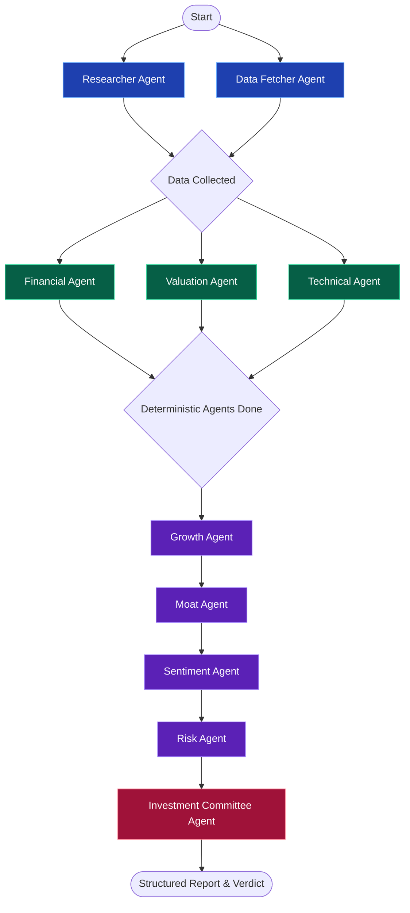

# AI Investment Research Agent

Altuni Research is an institutional-grade, multi-agent consensus network powered by **LangGraph.js** and **Next.js**, designed to automate comprehensive equity research. Given a company name, the application spawns a coordinated network of 10 highly-specialized AI agents to gather real-time web data, fetch financial metrics, analyze business fundamentals, map execution risks, and issue a final consensus verdict (INVEST or PASS) with an institutional scorecard.

---

## 🏗️ System Architecture & Workflow

The application implements a robust, stateful multi-agent network using **LangGraph.js**. To maximize performance and bypass strict free-tier LLM rate limits (e.g., Google Gemini's burst limits), the pipeline intelligently combines parallel execution for deterministic agents and sequential execution for qualitative LLM agents.

### LangGraph Workflow



### The Coordinated 10-Agent Network:
1. **Researcher Agent** (Data): Scrapes qualitative financial news, earnings releases, and macro sentiment using the Tavily Search API.
2. **Data Fetcher Agent** (Data): Fetches quantitative metrics via Alpha Vantage and Yahoo Finance. Features an intelligent LLM-extraction fallback mechanism if APIs are rate-limited.
3. **Financial Agent** (Deterministic): Quantitatively scores revenue growth, margins, ROE, and debt leverage.
4. **Valuation Agent** (Deterministic): Evaluates Forward P/E, PEG, and P/B ratios against industry standard thresholds.
5. **Technical Agent** (Deterministic): Analyzes moving averages (50/200 DMA) and price momentum to evaluate technical setups.
6. **Growth Agent** (Qualitative LLM): Evaluates future TAM, product pipelines, and growth catalysts.
7. **Moat Agent** (Qualitative LLM): Assesses competitive advantages, switching costs, and barriers to entry using Porter's Five Forces.
8. **Sentiment Agent** (Qualitative LLM): Processes recent news flow, management tone, and broad market sentiment.
9. **Risk Agent** (Qualitative LLM): Quantifies macroeconomic headwinds, regulatory threats, and execution risks.
10. **Investment Committee Agent** (Synthesis): Synthesizes the analysis from all 9 specialized agents to generate a structured investment verdict and dynamic consensus score.

---

## ✨ Features & Design Aesthetics
* **Multi-Agent Orchestration**: Built on top of LangChain's `StateGraph` for predictable pipelines, dynamic fallbacks, and modular reasoning loops.
* **Intelligent API Rate Limiting Bypass**: Qualitative agents are staggered sequentially to prevent 429 Too Many Requests errors on free-tier LLM API plans.
* **Server-Sent Events (SSE)**: Streams real-time operations logging and active node tracking from the server, making the UI highly responsive and dynamic.
* **Bloomberg-Terminal Inspired Dashboard**: A sleek, glassmorphic dark-theme UI featuring smooth micro-animations, indicator gauges, pro/con matrices, and dynamic interactive tabs.
* **Multi-LLM Native Support**: Supports **Google Gemini 2.5 Flash** (default), **Groq Llama 3.3 70B** (for lightning-fast inference), and **OpenAI GPT-4o** via simple environment variable switching.
* **Indestructible Fallbacks**: Quantitative data fetchers feature multi-layered fallbacks (Alpha Vantage -> Yahoo -> LLM Extraction -> Hardcoded Baseline) ensuring the app *never* crashes during live demos due to missing data.

---

## 🚀 Getting Started

### 1. Prerequisites
Ensure you have **Node.js (v18+)** installed.

### 2. Environment Setup
Create a `.env` file in the root directory (you can copy `.env.example` as a template):
```bash
cp .env.example .env
```
Fill in the following credentials:
```env
GEMINI_API_KEY=your_gemini_or_groq_api_key_here
TAVILY_API_KEY=your_tavily_api_key_here
ALPHA_VANTAGE_API_KEY=your_alpha_vantage_key_here
```
*(Note: To use Groq's lightning-fast models instead of Gemini, simply provide a Groq API key starting with `gsk_` into the `GEMINI_API_KEY` slot. The application will automatically detect it and route inference to Groq's `llama-3.3-70b-versatile`!)*

### 3. Installation
Install the project dependencies:
```bash
npm install
```

### 4. Run the App
Launch the Next.js development server:
```bash
npm run dev
```
Open [http://localhost:3000](http://localhost:3000) in your browser.

---

## 🛠️ Key Decisions & Technical Trade-offs

* **Why Next.js App Router?** 
  Next.js provides a unified frontend and backend API routing architecture. It allows us to stream agent states via standard `ReadableStreams` using Server-Sent Events (SSE), with excellent compile speeds and painless Vercel deployment.
* **Why LangGraph.js instead of simple LangChain chains?**
  A simple sequence of chains is rigid and brittle. LangGraph allows state validation at each node. Defining the agent as a compiled state graph makes it possible to scale to complex flows, implement multi-layered error-catching fallbacks, and stagger execution loops seamlessly.
* **Why Tavily Search API?**
  Standard Google/Bing search APIs return raw HTML that requires heavy cleaning. Tavily is specifically optimized for LLM agents, yielding structured content and summaries that prevent prompt clutter.

---

## 📁 Submission Package Contents
1. **/src**: React dashboard pages, components, agents logic, and Next.js backend API routes.
2. **ai_chat_transcript.md**: Text logs of the pair-programming session between the candidate and the AI.
3. **ai_transcript_2.md**: Extended AI interaction logs.
4. **README.md**: Setup guide, architecture, and design decisions.
