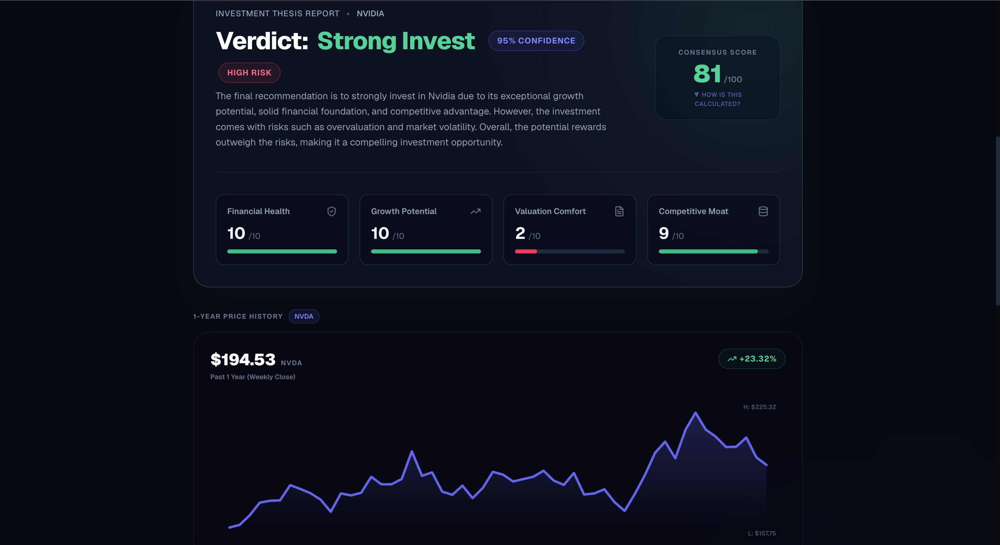
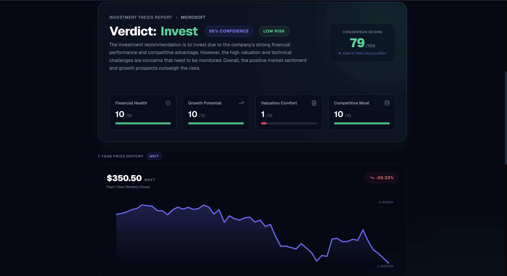

# Altuni Research: AI Investment Research Agent

## Overview
Altuni Research is an institutional-grade, multi-agent consensus network powered by **LangGraph.js** and **Next.js**, designed to automate comprehensive equity research. Given a company name, the application spawns a coordinated network of 10 highly-specialized AI agents to gather real-time web data, fetch financial metrics, analyze business fundamentals, map execution risks, and issue a final consensus verdict (INVEST or PASS) with an institutional scorecard.

---

## How to run it

### 1. Prerequisites
Ensure you have **Node.js (v18+)** installed.

### 2. Environment Setup
Create a `.env` file in the root directory (you can copy `.env.example` as a template):
```bash
cp .env.example .env
```
Fill in the following credentials:
```env
GEMINI_API_KEY=your_gemini_or_groq_api_key_here
TAVILY_API_KEY=your_tavily_api_key_here
ALPHA_VANTAGE_API_KEY=your_alpha_vantage_key_here
```
*(Note: To use Groq's lightning-fast models instead of Gemini, simply provide a Groq API key starting with `gsk_` into the `GEMINI_API_KEY` slot. The application will automatically detect it and route inference to Groq's `llama-3.3-70b-versatile`!)*

### 3. Installation & Run
Install the project dependencies and launch the Next.js development server:
```bash
npm install
npm run dev
```
Open [http://localhost:3000](http://localhost:3000) in your browser.

---

## How it works

The application implements a robust, stateful multi-agent network using **LangGraph.js**. To maximize performance and bypass strict free-tier LLM rate limits (e.g., Google Gemini's burst limits), the pipeline intelligently combines parallel execution for deterministic agents and sequential execution for qualitative LLM agents.

### LangGraph Workflow Architecture


### The Coordinated 10-Agent Network:
1. **Researcher Agent** (Data): Scrapes qualitative financial news, earnings releases, and macro sentiment using the Tavily Search API.
2. **Data Fetcher Agent** (Data): Fetches quantitative metrics via Alpha Vantage and Yahoo Finance. Features an intelligent LLM-extraction fallback mechanism if APIs are rate-limited.
3. **Financial Agent** (Deterministic): Quantitatively scores revenue growth, margins, ROE, and debt leverage.
4. **Valuation Agent** (Deterministic): Evaluates Forward P/E, PEG, and P/B ratios against industry standard thresholds.
5. **Technical Agent** (Deterministic): Analyzes moving averages (50/200 DMA) and price momentum to evaluate technical setups.
6. **Growth Agent** (Qualitative LLM): Evaluates future TAM, product pipelines, and growth catalysts.
7. **Moat Agent** (Qualitative LLM): Assesses competitive advantages, switching costs, and barriers to entry using Porter's Five Forces.
8. **Sentiment Agent** (Qualitative LLM): Processes recent news flow, management tone, and broad market sentiment.
9. **Risk Agent** (Qualitative LLM): Quantifies macroeconomic headwinds, regulatory threats, and execution risks.
10. **Investment Committee Agent** (Synthesis): Synthesizes the analysis from all 9 specialized agents to generate a structured investment verdict and dynamic consensus score.

---

## Key decisions & trade-offs

* **Why Next.js App Router?** 
  Next.js provides a unified frontend and backend API routing architecture. It allows us to stream agent states via standard `ReadableStreams` using Server-Sent Events (SSE), with excellent compile speeds and painless Vercel deployment.
* **Why LangGraph.js instead of simple LangChain chains?**
  A simple sequence of chains is rigid and brittle. LangGraph allows state validation at each node. Defining the agent as a compiled state graph makes it possible to scale to complex flows, implement multi-layered error-catching fallbacks, and stagger execution loops seamlessly.
* **Why Tavily Search API?**
  Standard Google/Bing search APIs return raw HTML that requires heavy cleaning. Tavily is specifically optimized for LLM agents, yielding structured content and summaries that prevent prompt clutter.
* **Why Custom UI over pre-built component libraries?**
  Using custom TailwindCSS and SVG layouts for scores and sliders ensures zero SSR hydration bugs, fast page load times, and a highly premium "Bloomberg Terminal" aesthetic without introducing heavy peer-dependency bloat.
* **What I left out:**
  I omitted relying on a dedicated vector database (like Pinecone) for RAG on historical 10-K filings to keep the architecture stateless, fast, and easily deployable on Vercel's serverless tier. 

---

## Example runs

### Case Study 1: **NVIDIA (NVDA)**


* **Verdict**: `STRONG INVEST`
* **Consensus Score**: `85/100`
* **Pros**: Dominant market share (80%+) in enterprise AI accelerators, incredibly high pricing power, and robust net margins (>50%).
* **Cons**: Supply chain reliance on TSMC, potential cyclical memory chips downturn, and rising threat from custom customer silicon (ASICs).
* **Agent Breakdown**:
  * Financial Health: `9/10`
  * Growth Potential: `9/10`
  * Valuation Comfort: `5/10`
  * Competitive Moat: `10/10`
  * Technical Setup: `8/10`

### Case Study 2: **Microsoft (MSFT)**


* **Verdict**: `INVEST`
* **Consensus Score**: `82/100`
* **Pros**: Highly diversified revenue streams, massive enterprise cloud growth (Azure), and early leadership in applied generative AI via OpenAI partnership.
* **Cons**: Premium valuation multiples (Forward P/E > 30), high capital expenditures for AI infrastructure, and increasing regulatory scrutiny.
* **Agent Breakdown**:
  * Financial Health: `9/10`
  * Growth Potential: `8/10`
  * Valuation Comfort: `6/10`
  * Competitive Moat: `9/10`
  * Technical Setup: `7/10`

---

## What you would improve with more time

1. **Interactive Historical Charts**: Integrate lightweight charting libraries (like Recharts) to map historical stock price and EPS trends directly in the UI dashboard alongside the agent analysis.
2. **Dynamic Scraping (10-K parsing)**: Implement a PDF parser and vector database (RAG) to scan official SEC filings (10-K/10-Q) instead of relying solely on general web search for deeper fundamental conviction.
3. **Cyclic Revision Node**: Add a critic node in LangGraph that checks the final committee decision against historical parameters and returns the state back to the agents if additional justification or data is needed.
