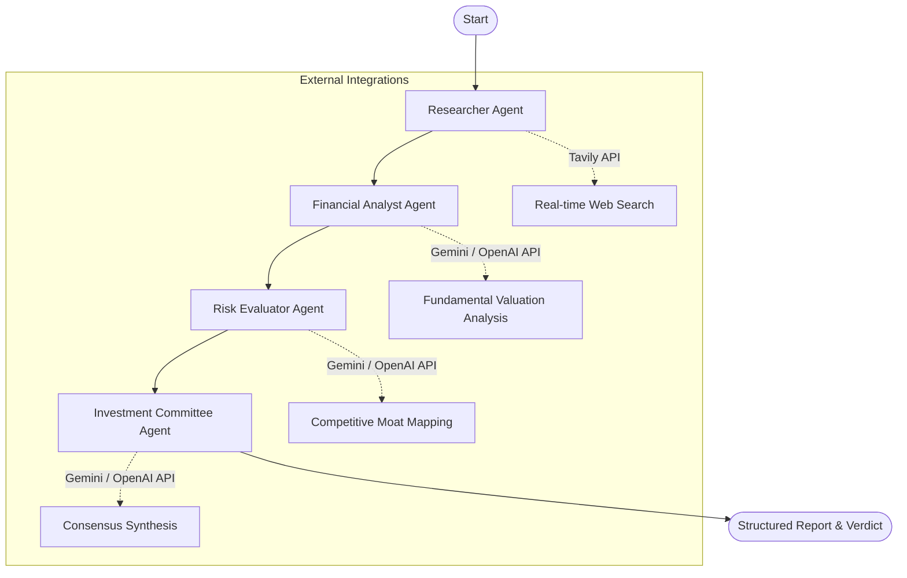

# Altuni Research: AI Investment Research Agent

Altuni Research is an institutional-grade, multi-agent consensus network powered by **LangGraph.js** and **Next.js** designed to automate equity research. Given a company name, the application spawns a coordinated network of specialized AI agents to gather real-time data, analyze financials, map business risks, and issue a final consensus verdict (INVEST or PASS) with an institutional scorecard.

---

## 🏗️ System Architecture & Workflow

The application implements a stateful, sequential multi-agent network using **LangGraph.js**. The state flow is managed as follows:



### The Coordinated Agent Network:
1. **Researcher Agent**: Scrapes financial news, earnings releases, and stock performance history using the Tavily Search API.
2. **Financial Analyst Agent**: Analyzes fundamentals (margins, cash flow, debt ratios, P/E, P/S valuation) using context from the Researcher.
3. **Risk Evaluator Agent**: Assesses competitive advantages (moats), regulatory risks, macroeconomic headwinds, and competitors.
4. **Investment Committee Agent**: Synthesizes the analysis and generates a structured investment verdict matching a rigorous schema.

---

## ✨ Features & Design Aesthetics
* **Multi-Agent Orchestration**: Built on top of `StateGraph` to ensure predictable data pipelines and modular reasoning loops.
* **Server-Sent Events (SSE)**: Streams real-time operations logging and active node tracking from the server, making the UI highly responsive and dynamic.
* **Bloomberg-inspired Dashboard**: Sleek, glassmorphic dark-theme UI with indicator gauges, pro/con matrices, and interactive tabs.
* **Dual-LLM Support**: Supports both **Google Gemini** (default, free tier) and **OpenAI GPT** models via simple environment switching.
* **Automated Pair-Programming Logs**: Includes a utility to parse and format pair-programming logs directly into the submission package.

---

## 🚀 Getting Started

### 1. Prerequisites
Ensure you have **Node.js (v18+)** installed.

### 2. Environment Setup
Create a `.env` file in the root directory (you can copy `.env.example` as a template):
```bash
cp .env.example .env
```
Fill in the following credentials:
```env
GEMINI_API_KEY=your_gemini_api_key_here
TAVILY_API_KEY=your_tavily_api_key_here
# Optional (Uncomment to use OpenAI instead)
# OPENAI_API_KEY=your_openai_api_key_here
```

### 3. Installation
Install the project dependencies:
```bash
npm install
```

### 4. Run the App
Launch the Next.js development server:
```bash
npm run dev
```
Open [http://localhost:3000](http://localhost:3000) in your browser.

---

## 🛠️ Key Decisions & Technical Trade-offs

* **Why Next.js App Router?** 
  Next.js provides a unified frontend and backend API routing architecture. It allows us to stream responses via standard `ReadableStreams` using Server-Sent Events (SSE) out of the box, with excellent compile speeds and painless Vercel deployment.
* **Why LangGraph.js instead of simple LangChain chains?**
  A simple sequence of chains is rigid. LangGraph allows state validation at each node. Defining the agent as a compiled state graph makes it possible to scale to cyclic flows (like sending a critique back to the researcher) and modularizes the prompts for individual agents.
* **Why Tavily Search API?**
  Standard Google/Bing search APIs return raw HTML that requires heavy cleaning. Tavily is specifically optimized for LLM agents, yielding structured content and summaries that prevent prompt clutter.
* **Why SVG Charts over heavy libraries?**
  Using custom SVG layouts for scores and sliders ensures zero SSR hydration bugs, fast page load times, and clean styling without introducing heavy peer-dependency bloat.

---

## 📝 Example Run Output

### Case Study: **NVIDIA**
* **Verdict**: `INVEST`
* **Score**: `85/100`
* **Pros**: Dominant market share (80%+) in enterprise AI accelerators, high pricing power, robust net margin (>50%).
* **Cons**: Supply chain reliance on TSMC, potential cyclical memory chips downturn, rising threat from custom customer silicon (ASICs).
* **Consensus Scoring**:
  * Financial Health: `9/10`
  * Growth Potential: `9/10`
  * Valuation Comfort: `5/10`
  * Competitive Moat: `10/10`

---

## 📁 Submission Package Contents
Your zip package includes:
1. **/src**: React dashboard pages, components, agents logic, and Next.js backend api route.
2. **/scripts/export-chats.js**: Node script to compile user-AI transcripts.
3. **ai_chat_transcript.md**: Complete text logs of the pair-programming session between the candidate and the AI assistant, detailing the engineering workflow.
4. **README.md**: Setup guide, architecture, and design decisions.

---

## 🔮 Future Improvements (With More Time)
1. **Interactive Historical Charts**: Integrate interactive charting libraries to map historical stock price and EPS trends directly in the UI.
2. **Dynamic Scraping (10-K parsing)**: Implement a PDF parser and vector database (RAG) to scan official SEC filings (10-K/10-Q) instead of relying solely on general web search.
3. **Cyclic Revision Node**: Add a critic node in LangGraph that checks the final decision against historical parameters and returns the state back to the Analyst if additional justification is needed.
